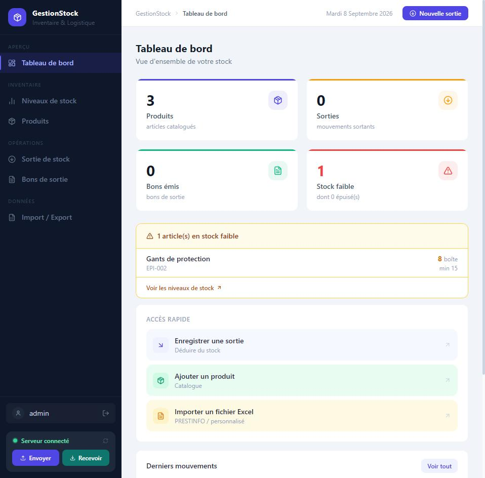
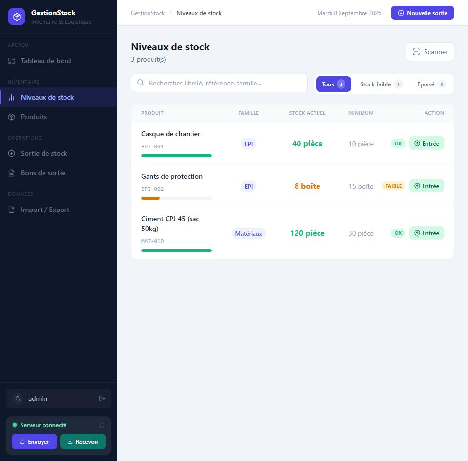
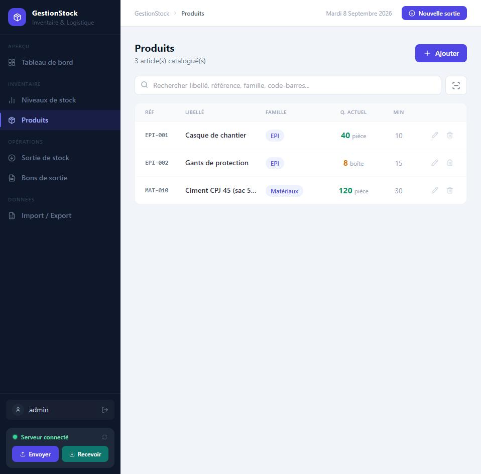
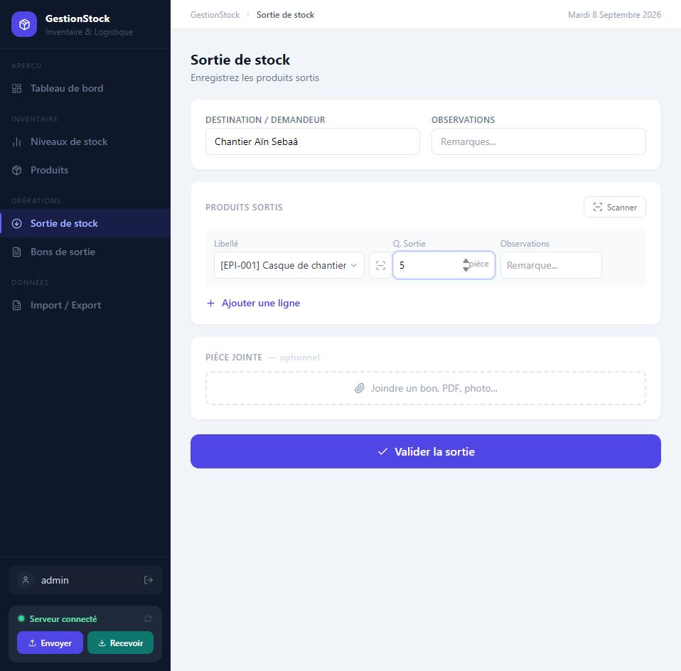
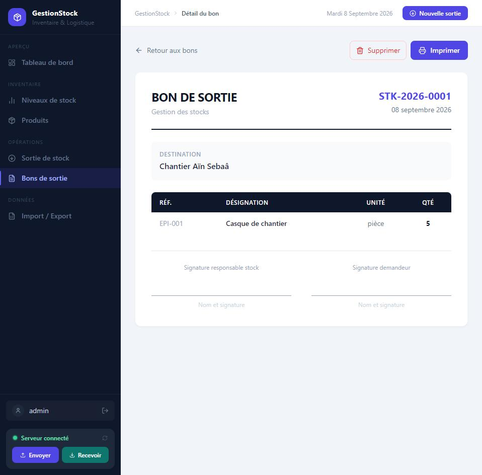

# GestionStock

Offline-first inventory management system for small and medium businesses, built with React and Express. Stock operations (products, movements, delivery notes) keep working without an internet connection, and can be synchronized on demand with a central SQLite server so several workstations share the same data.

## Features

- **Product catalog** — reference, category, unit, barcode, minimum stock threshold
- **Stock levels** — available quantity per product, computed from initial stock + movements, with low-stock / out-of-stock filters
- **Stock movements** — record stock-out operations, with barcode scanning to find a product instantly
- **Bons de sortie** (delivery / stock-out documents) — grouped movements with a document number, destination, optional attached file, and print support
- **Excel import / export** — bulk product import, data export
- **Authentication** — JWT-based login, password change endpoint
- **Offline-first** — all data lives locally in the browser (IndexedDB); the app is fully usable without a server
- **Multi-device sync** — push/pull local data to/from a central Express + SQLite server

## Tech stack

**Frontend**: React 19, Vite, Tailwind CSS, [Dexie](https://dexie.org/) (IndexedDB), `@zxing` (barcode scanning), `xlsx`, `react-to-print`

**Backend**: Node.js, Express, `better-sqlite3`, JWT (`jsonwebtoken`), `bcryptjs`

## Architecture

```
Browser (per workstation)
┌─────────────────────────────┐
│  React UI                   │
│    │                        │
│    ▼                        │
│  IndexedDB (Dexie)          │  ← works fully offline
└──────────────┬───────────────┘
               │  push / pull  (JWT-authenticated)
               ▼
        Express API (server/)
               │
               ▼
        SQLite (better-sqlite3)
```

Each workstation keeps a full local copy of the data in IndexedDB and can operate offline indefinitely. When the server is reachable, the sync bar lets a user push local changes to the shared SQLite database or pull the latest server state — the current implementation is a full-replace sync (last push wins), not a merge.

### Database schema evolution

The local schema (`src/db.js`) evolved through four Dexie versions as the data model was refined:

```
v1: products, movements, bons, bonItems
v2: + barcode on products
v3: + a dedicated "sorties" (stock-outs) table
v4: sorties merged into bons (bons gain isFormal + attached file fields)
    → existing "sorties" rows are migrated automatically into bons/bonItems
```

The v4 migration (`db.js`, `version(4).upgrade(...)`) rebuilds `bons` and `bonItems` from the old `sorties` table and relinks the corresponding `movements`, so upgrading an existing installation doesn't lose data.

## Getting started

### Prerequisites

- Node.js 20+

### Install

```bash
npm install
```

### Configure

```bash
cp .env.example .env               # frontend: API base URL (optional, defaults to localhost:3001)
cp server/.env.example server/.env # backend: JWT secret + admin credentials
```

Edit `server/.env` and set `ADMIN_USERNAME` / `ADMIN_PASSWORD` / `JWT_SECRET`. If you skip this, the server still starts: it generates a random JWT secret and a random admin password on first run and prints them once to the console — but for anything beyond local testing, set real values in `server/.env`.

### Run

```bash
npm run start   # runs the Vite dev server + the Express API together
```

- Frontend: http://localhost:5173
- API: http://localhost:3001

Other scripts: `npm run dev` (frontend only), `npm run server` (API only), `npm run build`, `npm run lint`, `npm test`.

## Testing

```bash
npm test
```

Uses Node's built-in test runner (`node --test`, no extra dependency):

- `tests/stock-calculation.test.js` — pure stock-calculation and stock-sufficiency logic
- `server/tests/auth.test.js` — login, token validation
- `server/tests/sync.test.js` — push/pull round-trip against a temporary SQLite database

## Screenshots






